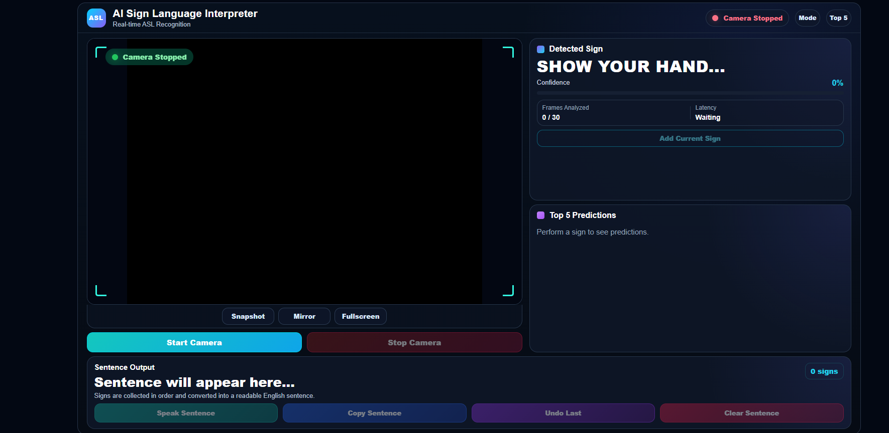
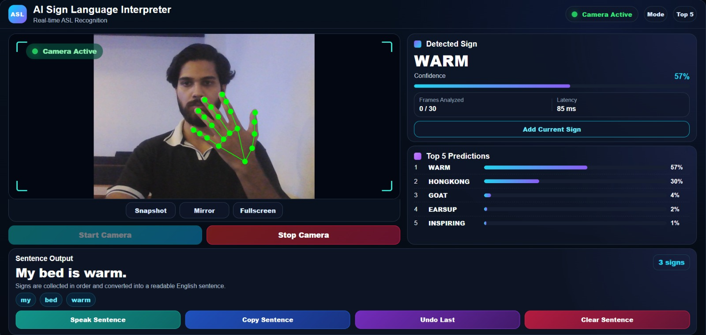

<h1 align="center">Hi 👋, I'm Sayyam Hassan</h1>
<h3 align="center">Full Stack Developer | AI Engineer | Computer Vision Enthusiast</h3>

  
  

<h3 align="center">🚀 About Me</h3>

I'm a Full Stack Developer with experience designing and building scalable web applications using NestJS, Node.js, Angular, React, MySQL, and REST APIs.

Most recently, I worked on enterprise property management solutions, developing backend APIs, database architecture, authentication systems, and modern frontend interfaces.

Alongside full-stack development, I'm passionate about Artificial Intelligence and Computer Vision. My final year project — an AI-powered Real-Time Sign Language Interpreter — integrates TensorFlow, MediaPipe, OpenCV, FastAPI, and Angular to perform real-time gesture recognition.

I'm actively seeking opportunities where I can combine software engineering, AI, and computer vision to build intelligent, production-ready applications.

📫 Let's connect on [LinkedIn](https://www.linkedin.com/in/sayyam-hassan-44012b2b7/).

##💼 Work Experience

Full Stack Developer (Remote) — Zohan Property Care, Dubai, UAE
Nov 2024 – June 2026

Improved API responsiveness by designing and optimizing RESTful APIs in NestJS and TypeScript for a production real estate platform serving real users
Strengthened database query performance by architecting normalized MySQL schemas and writing optimized queries for property listing and search functionality
Enhanced frontend load speed by integrating an Angular client with backend microservices, implementing lazy loading and reusable component architecture
Reduced deployment issues by introducing Git-based version control workflows and structured code review practices across the engineering team
Supported stable core booking features by resolving recurring production issues using Postman for API testing and validation

Web Developer Intern — Bitsol Technologies (Pvt. Ltd.), Islamabad, Pakistan
Aug 2024 – Oct 2024

Shipped reusable UI components by building responsive interfaces in React.js, HTML, and CSS, improving page load performance
Resolved frontend and backend bugs by debugging Node.js services and collaborating with senior developers using Git version control
Improved new-hire onboarding by documenting API endpoints and internal workflows for future interns

Android Developer Intern — Innovagic Technologies, Rawalpindi, Pakistan
Aug 2023 – Jan 2024

Delivered functional Android app features by contributing to UI design, coding, and testing across the full development lifecycle
Reduced crash reports by identifying and resolving bugs during pre-deployment testing phases
Supported internal IT projects by assisting cross-functional teams with technical documentation and task execution

##💼 Professional Projects

Zohan Property Care — Enterprise Property Management Platform
Contributed as a developer on a multi-portal real estate management system, working on backend APIs, database architecture, and frontend integration. Contributed code via feature branches, with commits reviewed and merged into the main codebase.

| Portal | Description | Link |
|---|---|---|
| 🌐 Main Website | Public-facing marketing site | [zohanpropertycare.com](https://www.zohanpropertycare.com/) |
| 🏢 Company Portal | Property configuration & management dashboard | [company.zohanpropertycare.com](https://company.zohanpropertycare.com/) |
| 🧑‍💼 Landlord Portal | Landlord-facing property asset management | [landlord.zohanpropertycare.com](https://landlord.zohanpropertycare.com/) |
| 🔐 Back Office | Internal operations portal | [bo.zohanpropertycare.com](https://bo.zohanpropertycare.com/) |

Note: Company, Landlord, and Back Office portals require authorized login access.

##🛠️ Tech Stack

Languages

  
  
  
  
  

Frontend

  
  
  
  
  

Backend

  
  
  
  
  
  

AI & Computer Vision

  
  
  
  
  
  
  
  
  
  

Databases

  
  

Tools

  
  
  
  
  

##Highlighted Project — AI Sign Language Interpreter

A real-time ASL (American Sign Language) recognition system that detects hand gestures via webcam, predicts signs using a trained deep learning model, and converts them into readable English sentences — with live confidence scoring and top-5 prediction ranking.

  
  

Key features:

Real-time hand landmark tracking with MediaPipe
Live confidence percentage + latency monitoring per frame
Top-5 prediction ranking for transparency into model output
Automatic sentence construction from a sequence of detected signs
Snapshot, mirror, and fullscreen camera modes
Text-to-speech playback of the constructed sentence

Tech stack: Python, TensorFlow, Keras, OpenCV, MediaPipe, FastAPI, Angular

### 🌟 Featured Projects

| Project | Description | Tech |
|---|---|---|
| [AI Sign Language Interpreter (Backend)](https://github.com/SayyamHassan/Ai-Sign-Language-Interpreter-backend) | Final Year Project — AI-powered real-time sign language detection engine | Python |
| [AI Sign Language Interpreter (UI)](https://github.com/SayyamHassan/Ai-Sign-Language-Interpreter-UI) | Frontend interface for the sign language interpreter | TypeScript |
| [University Information Chatbot](https://github.com/SayyamHassan/University-Information-chatbot) | Chatbot that answers university-related queries | Python |
| [World Population Visualizer](https://github.com/SayyamHassan/world-population-visualizer) | Interactive visualization of global population data | Python |
| [iNotebook](https://github.com/SayyamHassan/iNotebook) | Full-stack note-taking web app | JavaScript |
| [Hospital Management System](https://github.com/SayyamHassan/Hospital-Management-System) | Desktop system to manage hospital records | C++ |

---

### 📊 GitHub Stats

  
  

  

📬 Connect With Me

  
  
  

  <i>Thanks for stopping by! 🚀</i>

